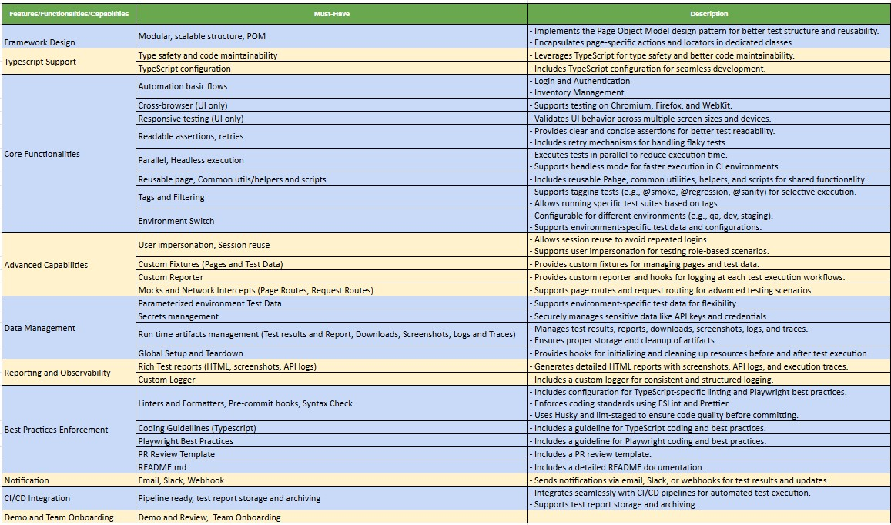

# playwright-ui-test-framework

## Table of Contents

- [Overview](#overview)
- [Key Features/Functionalities/Capabilities](#key-featuresfunctionalitiescapabilities)
- [Tech Stack](#tech-stack)
- [Prerequisite Software and Tools](#prerequisite-software-and-tools)
- [Project Structure and Folder/Files Description](#project-structure-and-folderfiles-description)
- [Installation](#installation)
- [Running Tests](#running-tests)
- [Generate and open Test Report](#generate-and-open-test-report)
- [Sending Notifications](#sending-notifications)
- [Validating Syntax and Linting Rules](#validating-syntax-and-linting-rules)

## Overview

This project is a Functional UI Test Automation Framework built using Playwright and TypeScript. It is designed to provide a robust, scalable, and maintainable solution for automating end-to-end UI testing for web applications. The framework includes features for test execution, reporting, and code quality enforcement, ensuring high-quality test automation.

## Key Features/Functionalities/Capabilities



This framework is designed to accelerate the development and execution of UI tests, ensuring high test coverage and reliability for web applications.

## Tech Stack

- Typescript
- Playwright
- Allure Report
- Monocart Report

## Prerequisite Software and Tools

- Node 20.X
- Yarn 1.22.x
- install java/jdk for Allure Report (Set JAVA_HOME)
- VS Code, or equivalent IDE
- Git

## Project Structure and Folder/Files Description

- `artifacts`: Contains the run time artifacts like downloads, logs, screenshots, and reports.
- `src`: Contains the src code, files and folders apart from tests.
  - `configs`: Contains configuration files for the framework, such as environment-specific settings.
  - `data`: Stores test data files, such as JSON or CSV files, used during test execution.
  - `environments`: Contains environment-specific configurations, such as URLs or credentials.
  - `fixtures`: Includes reusable test data or setup/teardown logic for tests.
  - `pages`: Implements the Page Object Model (POM) for web pages, encapsulating page-specific navigation, elements and actions.
  - `routes`: Defines Page routes or network interception logic for mocking or monitoring Page requests.
  - `scripts`: Contains utility scripts or automation scripts that are not directly part of the tests.
  - `utils`: Includes helper functions, utilities, or common modules used across the framework.
- `tests/`: Contains tests files and folders.
- `.editorconfig`: Contains the configuration for Editor.
- `.gitignore`: Contains the list of files and folders to be ignored by git.
- `.prettierignore`: Contains the list of files/folders Prettier must ignore.
- `.prettierrc`: Contains the configurations for Prettier.
- `CodingGuideline.md`: Contains the coding guideline for Typescript.
- `eslint.config.mjs`: Contains the
- `package.json`: Contains the nodejs packages and dependencies list, scripts.
- `playwright.config.ts`: Contains the playwright configurations.
- `README.md`: Contains the documentation for the project.
- `tsconfigs.json`: Contains the compilation configurations for TS.
- `yarn.lock`: Contains the locked version of nodejs packages and dependencies list, useful in CI environment.

## Installation

### Install yarn globally for yarn command line to work

```sh
npm install --global yarn
# Ensure the command `yarn -v` works.
yarn -v
```

### Clone the repository

```sh
git clone https://github.com/AshisRaj/playwright-ui-test-framework.git
```

### Packages installations

```sh
yarn install
```

### Install Playwright browsers

```sh
yarn playwright install
```

## Running Tests

```sh
# Run all tests in headless mode
yarn test
or
yarn run test
# Run all tests in headed mode
yarn test:headed
or
yarn run test:headed
# Run smoke tests
yarn test:smoke
or
yarn run test:smoke
# Run sanity tests
yarn test:sanity
or
yarn run test:sanity
# Run regression tests
yarn test:regression
or
yarn run test:regression
```

## Generate and open Test Report

```sh
yarn posttest
or
yarn posttest
```

## Sending Notifications

```sh
yarn notify-report:qa
or
yarn run notify-report:qa
```

## Validating Syntax and Linting Rules

It is recommended to run Linting and syntax validation scripts locally before pushing changes to your branch in order to prevent broken code, or code that does not meet basic coding standards, making it into your remote branch.

📝 Syntax, and linting errors, must be fixed before a feature branch is allowed to be merged with the main branch, i.e. `main`.

### Syntax Validation

```sh
yarn syntax-check
or
yarn run syntax-check
```

### Run Linting Rules

```sh
yarn lint
or
yarn run lint
```
